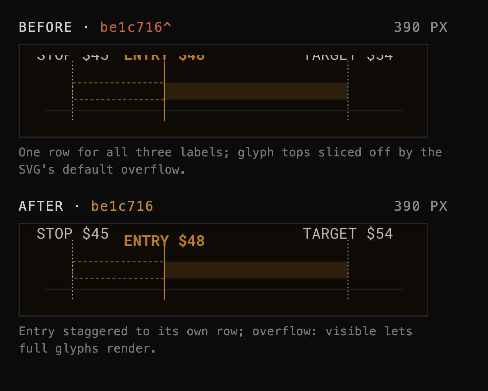

# Process overview

From the brief to the harness behind it.

## What I built

*Retail Market Survival: Risk, Leverage and Execution for Small Accounts* —
twelve weeks running from a first stock order to futures, options and crypto,
with one argument underneath: as holding periods shorten and instruments
complicate, price direction stops being the whole problem, and execution,
leverage, sizing and risk take over.

## What I decided a good course looks like, and what I did with it

Four things, settled up front: each week serves that one argument rather than
standing alone, weeks build on each other instead of sitting in parallel, no
week quietly carries twice another's weight, and assessment only draws on
what's already been taught.

The first and fourth went into the harness whole.
[`977c23d`](https://github.com/comp4020-agentic-coding-studio/comp4020-ass2-zdy-forever/commit/977c23d)
writes the twelve weeks into `CLAUDE.md` guarded by *do not reorder or
substantially change the purpose of a week unless I explicitly ask*, and fixes
the three assessment names and weights beside *assessment tasks must rely on
concepts taught before they are due*. Their mechanical half went to `spec/`:
[`59cf848`](https://github.com/comp4020-agentic-coding-studio/comp4020-ass2-zdy-forever/commit/59cf848)
added contract tests before any content existed, so later stages had something
to fail against, and `977c23d` sharpened them into what runs now — twelve
lectures and twelve sessions, weeks 1 through 12 exactly once, distinct titles
and teaching dates, weights of 20/35/45 summing to 100, every lecture pointing
at its own week's deck and no other's.

Difficulty I left out deliberately. The twelve lectures do share one
eight-section spine and four or five outcomes each, but I hold that by hand: a
person reads the week and judges the load. That is a standing `CLAUDE.md`
rule — no fake automated measures for subjective qualities — and it governs the
redesign in
[`2565c4b`](https://github.com/comp4020-agentic-coding-studio/comp4020-ass2-zdy-forever/commit/2565c4b),
which rebuilt the site as a market terminal, not a reskin, and forbids any test
claiming to measure whether it "looks different enough".

Because this is a curriculum, structure preceded content throughout: one shared
deck visual system
([`2308686`](https://github.com/comp4020-agentic-coding-studio/comp4020-ass2-zdy-forever/commit/2308686))
before any deck, the course content
([`edbbb27`](https://github.com/comp4020-agentic-coding-studio/comp4020-ass2-zdy-forever/commit/edbbb27))
before the twelve decks written against it.

## How I knew the result was right

Three kinds of promise, three checks. The structural ones the suite
owns: `pnpm check` runs sixteen of them against the built output. The teaching
ones I read for, since no test separates a genuine callback from a restated one.
The rendered page I open myself — *the rendered page is the truth; your mental
model of it isn't*, carried forward in
[`d66cb2c`](https://github.com/comp4020-agentic-coding-studio/comp4020-ass2-zdy-forever/commit/d66cb2c)
— and that is where a green build lies to you.

It did. Three interactive diagrams were garbled at the 390px marking viewport
while the suite stayed green, from one cause: a narrow-viewport font-size
override grows a label's footprint without growing the geometry tuned around it.

Per `CLAUDE.md`'s triage rule — content, missing rule, or missing check — the
four failure shapes it produces went into the harness
([`be1c716`](https://github.com/comp4020-agentic-coding-studio/comp4020-ass2-zdy-forever/commit/be1c716),
after the aspect-ratio lesson in
[`7ae7844`](https://github.com/comp4020-agentic-coding-studio/comp4020-ass2-zdy-forever/commit/7ae7844))
rather than three patched diagrams, so the next one is caught before it ships.

One more surfaced later, testing the brief's own unplanned-use example —
resizing mid-drag on the leverage slider. The resize itself held up, but at
high leverage against a low maintenance margin the call-trigger label went
negative-on-negative (`calls at −-6.7%`): the position is under margin from
the first tick, not at some future drop, a case the formatting never
accounted for.
[`72dc09f`](https://github.com/comp4020-agentic-coding-studio/comp4020-ass2-zdy-forever/commit/72dc09f)
treats a non-positive trigger as already called instead of reformatting the
string, verified by reproducing the original input and sweeping all three
diagrams' sliders to their extremes.
